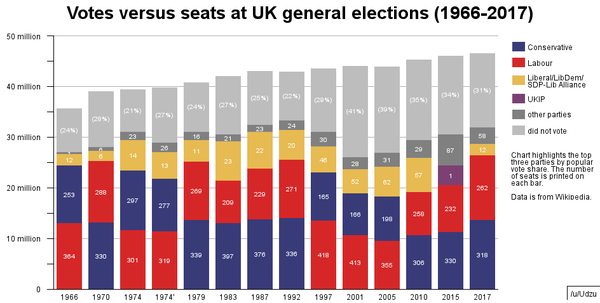
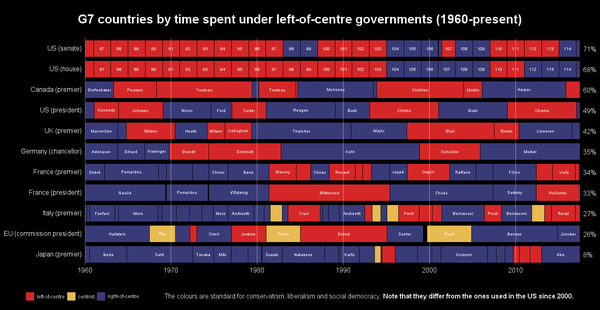
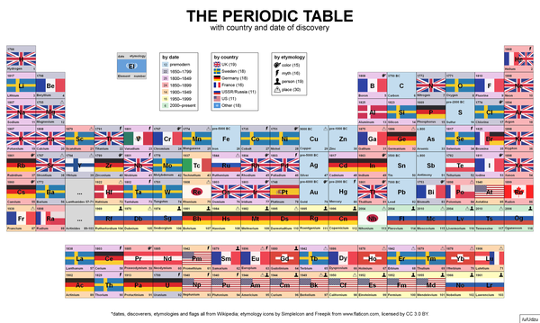
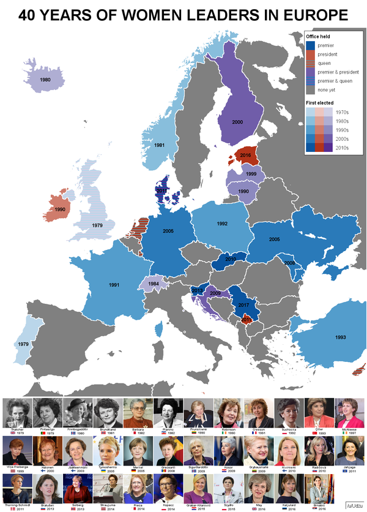

# [charts.py](charts.py)

## Summary 
Pillow-based charting.
 
## Dependencies
*Required*: [pillow](http://pillow.readthedocs.io/en/4.2.x/index.html), [pandas](http://pandas.pydata.org/), [toolz](http://toolz.readthedocs.io/en/latest/index.html),  [bamboo](bamboo.md), [pillar](pillar.md), [utils](utils.md).

*Optional*: [dates](dates.md) (for flexible time charts and month charts).

## Documentation

Three chart types are currently supported: **bar charts**, **time charts** and **grid charts**. For usage information, see the docstrings and [sample scripts](dataviz/).

### Legends

**generate_legend**: generate a chart category legend.

### Bar charts

**bar_chart**: generate a bar chart; supports grouped, stacked and percentage stacked charts, as well as horizontal charts and flexible coloring and labeling.

### Time charts

**time_chart**: generate a time chart; supports numeric and date timelines highlighting both ranges and events.

### Grid charts

**grid_chart**: generate an image grid chart; essentially a convenient wrapper for `Image.from_array`.

### Map charts

**map_chart**: generate a map chart. Input is a map template with each region having a unique color. Regions can be named (see generate_name_csv), labelled (see generate_bbox_csv) and have overlays such as label arrows.

### Calendar charts

**month_chart**: generate a calendar chart for a given month.