# [patterns.py](pudzu/sandbox/patterns.py)

## Summary 
NFA-based grep-style pattern matcher supporting some novel spatial conjunctions and modifiers.
Originally developed to analyse wordplay for setting or solving cryptic crosswords.

## Dependencies
*Required*: [graphviz](https://graphviz.org/), [pudzu-utils](https://github.com/Udzu/pudzu-packages/tree/master/pudzu-utils).

## Documentation
For supported syntax and arguments, see `python -m pudzu.sandbox.patterns --help`.
For an explanation of the implementation, read on.

## Some background

### Regular expressions

A **regular expression** is a string that describes a search pattern.
It is built of literal characters (e.g. `a` matches the string "a"),
concatenation (e.g. `the` matches the string "the"),
alternation (e.g. `a|the` matches both "a" and "the"),
and the Kleene star (e.g. `(he)*` matches zero or more repetitions of "he").

The set of strings described by a regular expression is called a **regular language**.
Recognising whether a specific string belongs to a regular language (and hence
matches the search pattern) can be implemented efficiently using a **finite automaton**
(see below). Note that modern regular expression engines typically include
additional search pattern features, some of which let you describe languages that are no longer regular
and require additional work to recognise.

The patterns in this module are all regular and are matched using finite automata. 

### Deterministic finite automata

A **deterministic finite automaton (DFA)** is a type of abstract machine with
finitely many states (=a finite state machine, or FSM) that either accepts or rejects
a string of characters. There is a single start
state and zero or more end states. Additionally there are transitions between
states: for each character and state there may be a single transition to another
(possibly the same) state.

Figuring out whether a DFA matches a string simply involves following transitions
from the start state, consuming one character from the input at a time. If, once
the whole string has been consumed, the machine has reached an accepting state, then
the string is accepted. Otherwise it is rejected. Note that this involves looking at
each input character just once, even when the DFA corresponds to a pattern containing
alternation. For example, the following DFA matches the possessive pronouns
their, her, his and xyr:

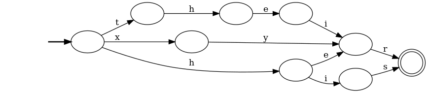

### Nondeterministic finite automata

A **nondeterministic finite automaton (NFA)** is the same as a DFA except that
there may be more than one transition from a given state for a given input character.
When following these transitions the automaton picks one "arbitrarily".
A string is matched if there exists a "luck run" of choices leading to an accepting state.
Additionally, NFAs are often also allowed to include **empty transitions** (marked by an ε)
which the machine may choose to follow without consuming any input character. For example,
the following NFA matches the same possessive pronouns as the DFA above:

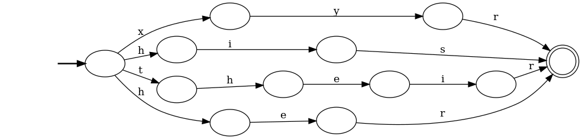

Figuring out whether an NFA matches a string can be implemented with backtracking:
whenever you reach a choice, try one transition and if that doesn't work backtrack and try
another. However, it can also be implemented *without* backtracking: rather than
keeping track of which single state you're in at every step, you can keep track of the *set
of all possible states* you could be in, and for each input character follow all the
possible transitions from each of those states.
You then accept the string iff the final set of states contains at least one accepting state.
The NFAs in this module are implemented this way.

This approach also provides a way of **turning any NFA into an equivalent DFA**, with the states of
the DFA corresponding to *sets of states* in the NFA. You simply start at the NFA's start state and
process every possible input character, leading to a new set of states for each one.
You then repeat the process from these sets of states, marking any set of states that contains
an accepting state as accepting. To compile a pattern into a
DFA, use the `-D` argument or `(?D:...)` expression modifier.

## NFA constructions

The bulk of this module involves constructing NFAs from an
extended regular expression language. Here is a summary
of the supported syntax and how the constructions work. Note that
these constructions are not necessarily the most efficient: that
is something that may be addressed later.

### Thompson's construction

Basic regular expressions are converted into NFAs
using a standard construction called **Thompson's construction**.

**Literal characters** are converted in the obvious fashion:

```bash
python -m pudzu.sandbox.patterns "a"
```

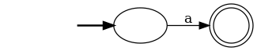

**Concatenation** is converted by linking the end state of the first part
with the start state of the second part.

```bash
python -m pudzu.sandbox.patterns "the"
```

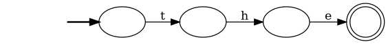
  
**Alternation** is converted using empty transitions:

```bash
python -m pudzu.sandbox.patterns "a|the"
```

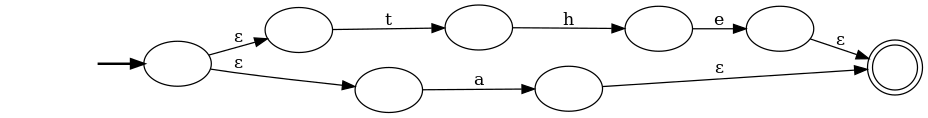

As is the **Kleene star**:

```bash
python -m pudzu.sandbox.patterns "(he)*"
```

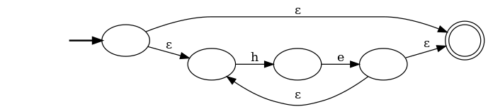

### Standard syntax extensions

There are a number of standard regular expression syntax extensions that still
generate regular languages:

**Character shorthands**: the `.` wildcard and bracketed character classes
  such as `[abc]` and `[^aeiou]` can easily be converted into a two state FSM
with the appropriate transitions. For visualisation reasons, I decided to introduce a 
special * state transition that's used if there is no other match. This allows
visualising a negated class like `[^a]` without showing every possible matching input.
However, for efficiency reasons it's more common to implement transitions via a lookup table of character
values.
  
```bash
python -m pudzu.sandbox.patterns "[ae].[^y]"
```

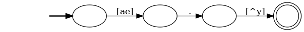

**Repetition shortands**: the `?` (zero or one), `+` (one or more), `{m,n}` (m to n) 
and `{m,}` (m or more) operators can be converted by a combination of
repeated concatenation and Kleene star. 

```bash
python -m pudzu.sandbox.patterns "o+h?"
```

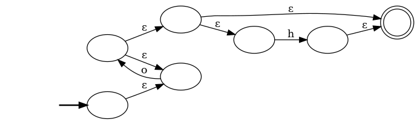

**Case-insensitive matches**. The simplest way to implement case insensitivity
is to simply expand all characters into two element character classes. To mark
just a subexpression as case insensitive use the `(?i:P)` syntax. Note that this does not implement
full Unicode case insensitivity, where string length may change between cases
(e.g. fußball and FUSSBALL) and where case may depend on locale (e.g. in Turkish
i uppercases to İ not I).

```bash
python -m pudzu.sandbox.patterns "(?i:The)"
```

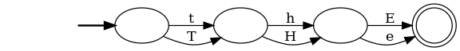


### Less common extensions

There are also a number of syntax extensions that are regular but are rarely supported,
mostly since they don't play nicely with common non-regular
extensions such as backreferences.

**Conjunction** (written as `A&B`). If A and B are regular expressions, then the language that 
satisfies both expressions is also regular. One way to implement this is
define an NFA whose states are pairs of states (a,b) from A and B, and whose
transitions are (a,b) → (a',b') for input q if both a→a' and b→b' for q. The start
state is (a_start, b_start) and end state is (a_end, b_end), and some additional transitions
are necessary to handle empty transitions in A or B. This construction (like
many of the others described later on) can produce lots of superfluous states,
so it can be useful to remove redundant states from the result: e.g. ones not
reachable from the start state, or ones that cannot reach the end state.


```bash
python -m pudzu.sandbox.patterns "(b+)&(...)"
```

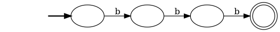

**Negation** (written a `¬A`). If A is a regular expression, then the language
that rejects everything A satisfies and accepts everything it doesn't is also regular.
It's easy to negate a DFA: just swap the
accepting and non-accepting states. Negating an NFA can therefore be done
by converting it to a DFA first. Negation also suggests a different way to implement
conjunction: `A&B` can alternatively be implemented as `¬(¬A|¬B)`.

```bash
python -m pudzu.sandbox.patterns "¬(..)"
```

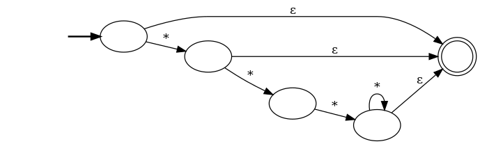

**Reversal** (written as `(?r:A)`). If A is a regular expression, then the language
that accepts the same strings but in reverse order is also regular. This time the
construction is easier for NFAs than DFAs: you just reverse the edges and swap
the start and end states.

```bash
python -m pudzu.sandbox.patterns "(?r:o+h|no)"
```

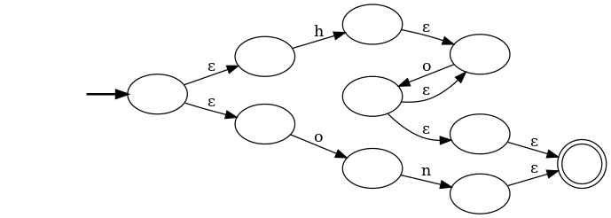

###Novel separating operators

The main novel regular operators introduced in this module are all separating
operators: that is, they describe strings that can be separated into
two parts, each satisfying a separate regular expression. Concatenation is
the standard example of this, where the two parts are then concatenated
one after the other. Other examples include:

**Containment** (written `A<B` or `B>A`). A string satisfies `A<B` or `B>A` if
it can be separated into a string satisfying `A` inside a string satisfying `B`.
For example "loooll" satisfies `o+<l+`. To implement `A<B` we define an NFA
with three types of states: left(a) for every a in A, middle(a, b) for every
a in A and b in B, and right(a) for every a in A again. The left and right states
transition within themselves according to the transitions A, while the middle
states transition with themselves according to the transitions of B (leaving the
a state unchanged). Additionally there are empty transitions from left(a) to
middle(a, B_start), and from middle(a, B_end) to right(a) for all a. The NFA
starts at left(A_start) and ends at right(A_end).

```bash
python -m pudzu.sandbox.patterns "o+<l+" -M
```

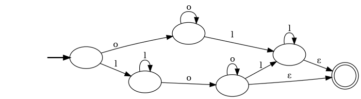

**Strict containment** (written `A<<B` or `B>>A`). The containment 
operators above include the cases where the string satisfying `A` 
occurs before or after any of the string satisfying `B`, and so isn't strictly 
contained within it. We can implement strict containment by adding two more
types of state, left_first(a) and right_first(a). These transition within
themselves according to the empty transitions of A, and transition to left
and right states according to the non-empty transitions. The NFA now starts at
left_first(A_start), and middle states transition to right_first rather than right. 

```bash
python -m pudzu.sandbox.patterns "o+<<l+" -M
```

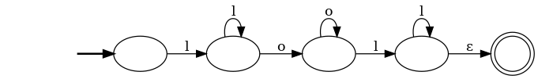

**Alternating** (written `A#B` or `A##B`). A string satisfies `A##B` if the
substring made up of every other character starting with the first satisfies `A`,
while the substring starting with the second satisfies `B`. For example "UwUwU" satisfies
`U+##w+`. To implement this, we define an NFA with two type of states: left(a,b) 
and right(a,b) for a in A and b in B. The left states transition between themselves
using the empty transitions of A, and to the right states using the non-empty
transitions of A.
The right states transition similarly using the transitions of B. The start state
is left(A_start, B_start) and the end state is both right(A_end, B_end) and
left(A_end, B_end). Another version `A#B` that doesn't specify which of A or B
comes first adds an additional state make right(A_start, B_start) an additional
start state.

```bash
python -m pudzu.sandbox.patterns "U+##w+" -M
```

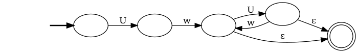

**Interleaving** (written `A^B` or `A^^B`). A string satisfies `A^B` if it can
be split into a string satisfying `A` interleaved into one satisfying `B`.
For example, "tAAhAe" satisfies `the^A+`. To implement this, we define an
NFA with two types of states, similar to the alternating operator: left(a,b)
and right(a, b). The left states transition between themselves like A (leaving b
unchanged), and the right steps like B (leaving a unchanged). Furthermore,
there are empty transitions between left(a, b) and right(a, b) for all a and b.
The start state is left(A_start, B_start) and the end state left(A_end, B_end)
(or alternatively right, as they're equivalent).
Another version `A^^B` that insists that B is strictly inside A is implemented
similarly to strict containment above.

```bash
python -m pudzu.sandbox.patterns "the^^A+" -M
```

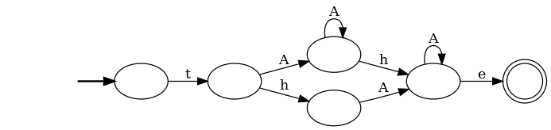


### Novel subtraction operators

All the separating operators (including concatenation) have
corresponding subtraction operators. These all describe strings that
can be made to satisfy one regular expression by extending them
with another string satisfying a second regular expression.

---

🚧🚧🚧🚧 **WIP from here...** 🚧🚧🚧🚧

---

**Left and right subtraction** (written `A-B` or `A_-B`). The simplest
for of subtraction is left and right subtraction. A string satisfies `A-B` if 
you can concatenate a string satisfying `B` to the end so that the result
satisfies `A`. For example "th" and "" both satisfy "(the|a)-.". `A_-B` is similar,
but requires concatenation on the left. 

**Subtraction inside and outside** (written `A->B`, `A->>B`, `A-<B` or `A-<<B`).

**Subtraction alternating and interleaved** (written `A-#B`, `A-##B`, `A-^B`, `A-^^B` or `A_-^^B`).

**Slicing** (written `(?S:A)[m:n]` or `(?S:A)[m:n:s]`).

### Other pattern syntax

**Cipher shifting** (written `(?s<n>:P)` or `(?s:P)`).

**Pattern references** (written `(?&ID=P)` and `(?&ID)`)

**Dictionary files** (written `\w`)

**Explicit FSMs** (written `\f`)

## Other NFA operations

### Trimming NFAs

### Minimizing NFAs

### Generating examples

### Generating an equivalent regular expression

### Generating NFA diagrams
