# [pillar.py](pillar.py)

## Summary 
Various Pillow utilities. These are monkey-patched on, allowing continued use of the Image.new factory function. Most have only been tested in RGB/RGBA modes and may not work in other modes. For full features and parameters, see docstrings.
 
## Dependencies
*Required*: [pillow](http://pillow.readthedocs.io/en/4.2.x/index.html), [toolz](http://toolz.readthedocs.io/en/latest/index.html), [utils](utils.md).

*Recommended*: [numpy](http://www.numpy.org/) (various color and shape features).

*Optional*: [pyphen](http://pyphen.org/) (for text hyphenation), [requests](http://docs.python-requests.org/en/master/) (for HTTP request headers).

## Documentation

### Helper classes and functions

**Padding**: a class representing box padding, initialized from one, two or four integers. Any function below that has a padding parameter can be passed any of these. A few functions such as `pin` also accept one to indicate and update coordinate offsets when expanding images.

```python
>> Padding(10)
Padding(l=10, u=10, r=10, d=10)
>> Padding((10,0))
Padding(l=10, u=0, r=10, d=0)
>> Padding((10,0,0,5)) + Padding((0,10,0,0))
Padding(l=10, u=10, r=0, d=5)
```

**Alignment**: a class representing element alignment, initialized from one or two floats between 0 and 1. Any function below that has an element alignment parameter can be passed one of these.

```python
>> Alignment(0.5)
Alignment(x=50%, y=50%)
>> Alignment((0,1))
Alignment(x=0%, y=100%)
```

**RGBA**: named tuple representing RGBA colors. Can be initialised by name, integer values, float values, hex strings or keyword arguments.

```python
>> RGBA("yellow")
RGBA(red=255, green=255, blue=0, alpha=255)
>> RGBA("yellow")._replace(alpha=0)
RGBA(red=255, green=255, blue=0, alpha=0)
>> RGBA("#fafafa")
RGBA(red=250, green=250, blue=250, alpha=255)
>> RGBA("#fafafa80")
RGBA(red=250, green=250, blue=250, alpha=128)
>> RGBA((100,50,50,5))
RGBA(red=100, green=50, blue=50, alpha=5)
>> RGBA(100,50,50,5)
RGBA(red=100, green=50, blue=50, alpha=5)
>> RGBA(100,50,50)
RGBA(red=100, green=50, blue=50, alpha=255)
>> RGBA(0.,0.5,0.5)
RGBA(red=0, green=128, blue=128, alpha=255)
>> RGBA(red=100, green=50, blue=50)
RGBA(red=100, green=50, blue=50, alpha=255)
>> RGBA(None)
RGBA(red=0, green=0, blue=0, alpha=0)
```

**NamedPaletteMeta**: a metaclass to help define named palettes.

```python
>> class RGBPalette(metaclass=NamedPaletteMeta):
       RED = "#e41a1c"
       GREEN = "#4daf4a"
       BLUE = "#377eb8"
>> RGBPalette.RED
'#e41a1c'
>> RGBPalette("green")
'#4daf4a'
>> RGBPalette["Blue"]
'#377eb8'
>> RGBPalette[2]
'#377eb8'
>> list(RGBPalette)
['#e41a1c', '#4daf4a', '#377eb8']
>> RGBPalette.names
('RED', 'GREEN', 'BLUE')
```

**font**: shorthand function for generating a truetype font object defaulting to standard variant naming (e.g. arialbd or calibrib). Also, **arial**, **calibri** and **verdana** are predefined.

```python
>> font("times", 24, italics=True)
<PIL.ImageFont.FreeTypeFont at 0x48e9ad0>
>> [_.font.family, _.font.style, _.size]
['Times New Roman', 'Italic', 24]
>> arial(24, bold=True)
<PIL.ImageFont.FreeTypeFont at 0x4a335f0>
```

### Colormap generators

These generate matplotlib-compatible colormaps, e.g. for use with Image.from_gradient below. Requires numpy.

**GradientColormap**: generate a colormap from a sequence of colors, and optionally the spacing intervals between them. Can also be used as a discrete cycling colormap.

```python
>> cmap1 = GradientColormap("black", (0,128,0,128), "#008000", intervals=(1,2))
>> cmap1
GradientColormap(0%=#000000ff, 67%=#00800080, 100%=#008000ff)
>> RGBA(*cmap1(0.5))
RGBA(red=0, green=112, blue=0, alpha=160)
> RGBA(*cmap1(5)) # alternatively, cmap1[5]
RGBA(red=0, green=128, blue=0, alpha=255)
>> cmap1.colors
(RGBA(red=0, green=0, blue=0, alpha=255),
 RGBA(red=0, green=128, blue=0, alpha=128),
 RGBA(red=0, green=128, blue=0, alpha=255))
>> Image.from_gradient(cmap1, (100,20)).show()
```

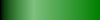

**SequenceColormap**: generate a colormap from a sequence of other colormaps, with optional spacing:

```python
>> import seaborn as sns
>> cmap2 = sns.diverging_palette(0, 255, as_cmap=True)
>> cmapmid = GradientColormap(cmap1(1., bytes=True), cmap2(0., bytes=True))
>> cmap12 = CompoundColormap(cmap1, cmapmid, cmap2, intervals=(3,1,3))
>> Image.from_gradient(cmap12, (100,20)).show()
```

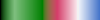

**ConstantColormap**/**PaletteColormap**: generate a colormap from either one or a sequence of constant colors. The latter can also be used as a discrete cycling colormap.

```python
>> cmap3 = PaletteColormap("#008000", cmap2(0., bytes=True), cmap2(1., bytes=True), intervals=(3,1,3))
>> cmap3
PaletteColormap(0%-43%=#008000ff, 43%-57%=#d43c69ff, 57%-100%=#4675caff)
>> Image.from_gradient(cmap3, (100,20)).show()
```


**BlendColormap**: generate a colormap blending between two other colormaps, with an optional blend function:

```python
>> cmapo12 = BlendColormap(ConstantColormap("orange"), cmap12)
>> Image.from_gradient(cmapo12, (100,20)).show()
```

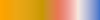

**FunctionColormap**: generate a colormap from numpy-aware channel functions (or constants) mapping 0-1 to 0-1. Supports either RGBA or HSLA.

```python
>> Image.from_gradient(FunctionColormap(lambda i:(np.sin(i*8*np.pi)+1)/2, identity, identity), (100,20)).show()
```

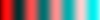

```python
>> Image.from_gradient(FunctionColormap(identity, 1, 0.75, hsl=True), (100,20)).show()
```
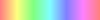


### ImageColor

**ImageColor.to_hex**: converts an RGB or RGBA color to hex (ignoring any alpha channel by default). Can be called directly on RGBA named tuples.

```python
>> RGBA("yellow").to_hex()
'#ffff00'
>> ImageColor.to_hex((100,50,50))
'#643232'
>> ImageColor.to_hex((100,50,50,5))
'#643232'
>> ImageColor.to_hex((100,50,50,5), alpha=True)
'#64323205'
```

**ImageColor.blend**: blend two colors together, using sRGB gamma correction by default. Similarly, **ImageColor.brighten** and **ImageColor.darken** blend with white and black, while preserving alpha. Can be called directly on RGBA named tuples. Also see **Image.Image.blend**.

```python
>> ImageColor.blend("blue", "red", 0.5)
RGBA(red=188, green=0, blue=188, alpha=255)
>> ImageColor.brighten("yellow", 0.5)
RGBA(red=255, green=255, blue=188, alpha=255)
>> ImageColor.brighten("yellow", -0.5)
RGBA(red=188, green=188, blue=0, alpha=255)
```

**ImageColor.alpha_composite**: alpha composite two or more colors. Similarly, **ImageColor.alpha_blend**, which does the same thing but supports sRGB gamma correction.

```python
>> ImageColor.alpha_composite("red", "#00FF0080")
RGBA(red=127, green=128, blue=0, alpha=255)
>> ImageColor.alpha_blend("red", "#00FF0080")
RGBA(red=187, green=188, blue=0, alpha=255)
```

### ImageDraw

**ImageDraw.text_size**: same as ImageDraw.Draw.textsize but doesn't require a drawable object, and handles descenders on multiline text and negative horizontal offsets.

```python
>> ImageDraw.text_size("The rain", arial(24))
(88, 22)
```

### Image

**Image.from_url**: create an image from a URL. **Image.from_url_with_cache** does the same but uses a file cache (with a default filename structure of cache_directory/hostname/hash_of_path.extension, plus an accompanying .source file containing the URL).

```python
>> Image.from_url('https://assets-cdn.github.com/images/modules/logos_page/Octocat.png')
[10:05:03] pillar:DEBUG - Reading image from https://assets-cdn.github.com/images/modules/logos_page/Octocat.png
>> Image.from_url_with_cache('https://assets-cdn.github.com/images/modules/logos_page/Octocat.png')
[10:05:27] pillar:DEBUG - Reading image from https://assets-cdn.github.com/images/modules/logos_page/Octocat.png
[10:05:28] pillar:DEBUG - Saving cached image to cache\assets-cdn.github.com\d4b25973fbbe302e1b486000f43aa25b9c61f9bf.png
>> Image.from_url_with_cache('https://assets-cdn.github.com/images/modules/logos_page/Octocat.png')
[10:05:38] pillar:DEBUG - Loading cached image at cache\assets-cdn.github.com\d4b25973fbbe302e1b486000f43aa25b9c61f9bf.png
```

**Image.from_text**: creates an image from text and font. Supports word-wrapping, alignment, padding and hyphenation. Wrapping can use an arbitrary tokenizer (it uses whitespace splitting by default) and hyphenation requires a hyphenator (the phyphen module is a good source of these).

```python
>> Image.from_text("The rain", arial(16, bold=True), fg="white", bg="#1f5774", padding=10).show()
```


```python
>> Image.from_text("dedicated to the proposition that all men are created equal", arial(16),
                   fg="white", bg="black", max_width=100, align="center", padding=5).show()
```

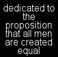

```python
>> Image.from_text("dedicated to the proposition that all men are created equal", arial(16), 
                   fg="white", bg="black", max_width=100, align="left", padding=5,
                   hyphenator=language_hyphenator("en_EN")).show()
```

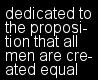

**Image.from_multitext**: creates an image from multiple texts, fonts and colors, correctly lining up baselines. Only supports single-line texts; for multline texts, combine images with Image.from_column (with equal_heights set to True). Supports underlining and strikethrough.

```python
>> Image.from_multitext(["The ", "rain ", "in ", "Spain"],
                        [arial(16), arial(16, bold=True), arial(16), arial(48)],
                        ["white", "red", "white", "white"], "#1f5774").show()
```


```python
>> Image.from_multitext(("Underline", " and ", "strikethrough"), arial(24), "white", "#1f5774",
                        underlines=(2,0,0), strikethroughs=(0,0,1)).show()
```


**Image.from_markup**: creates an image from simple text markup and a font family. Supported attributes are: \*\*bold\*\*, //italics//, \_\_underline\_\_, \~\~strikethrough\~\~ and \[\[color\]\]. Attributes can be nested or escaped with backslashes.

```python
>> Image.from_markup("The rain in __**Spain**__ stays //mainly in the plain//. ([[http:\\//spain.weather.com/]])",
                     partial(arial, 16),max_width=300).show()
```


**Image.from_text_bounded**: like from_text but with a maximum image size, maximum font size and a size-to-font function. Successively tries smaller fonts until the result would fit in the bounding box. Similarly, **Image.from_markup_bounded**. For generic images, there is also **Image.generate_bounded**.

```python
>> Image.from_text_bounded("The rain in Spain", (200, 200), 48, arial, fg="white", bg="#1f5774", padding=10).show()
```


**Image.from_array**: create an image from an array of images. Similarly, **Image.from_row** and **Image.from_column** create images form a list of images.

```python
>> Image.from_array([[Image.from_text("{}×{}={}".format(x,y,x*y), arial(16), "white") for x in (2,4,8)] for y in range(5)],
                    padding=(5,2), xalign=(0,0.5,1), bg="#1f5774").show()
```                    

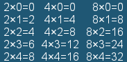

**Image.from_pattern**: create an image from a background pattern, either scaled or tiled. Similarly, **Image.from_vertical_pattern** and **Image.from_horizontal_pattern** automatically scale to the image width or height.

```python
>> flag = Image.from_url("https://upload.wikimedia.org/wikipedia/en/thumb/a/ae/Flag_of_the_United_Kingdom.svg/800px-Flag_of_the_United_Kingdom.svg.png").convert("RGBA")
>> Image.from_pattern(flag.resize_fixed_aspect(width=50), (150,150)).show()
```

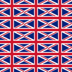

```python
>> Image.from_vertical_pattern(flag, (150,150)).show()
```


```python
>> Image.from_horizontal_pattern(flag, (150,150), align=0.5).show()
```


**Image.from_gradient**: create a gradient image using a matplotlib-style color map. Requires numpy. Also see colormaps above.

```python
>> Image.from_gradient(cmap2, (100,100)).show()
```

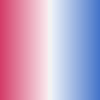

```python
>> Image.from_gradient(cmap2, (100,100), direction=(-1,1)).show()
```

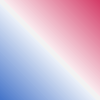

**Image.EMPTY_IMAGE**: an empty "RGBA" image.

```python
>> Image.EMPTY_IMAGE
<PIL.Image.Image image mode=RGBA size=0x0 at 0x497C310>
```

### Image.Image

**Image.Image.overlay**: like Image.Image.paste, but alpha composites the image and supports a copy parameter.

```python
>> base = Image.new("RGB", (100,60), "blue")
>> base.overlay(Image.from_text("red", arial(24), "white"), (0,0), copy=True).show()
```

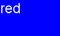

**Image.Image.place**: overlay an image at the given alignment and padding.

```python
>> img = Image.from_text("red", arial(24), "white", "grey")
>> base.place(img).show()
```


```python
>> base.place(img, align=(0,1), padding=5).show()
```

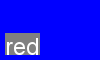

**Image.Image.pin**: pin an image on another, expanding the base image if necessary.

```python
>> base.pin(img, (0,30), bg="black").show()
```

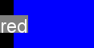

```python
>> base.pin(img, (0,30), align=(1,0.5), bg="black").show()
```

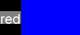

**Image.Image.pad**: pad an image.

```python
>> base.pad(5, "grey").show()
```

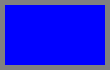

```python
>> base.pad((10,10,0,0), "grey").show()
```

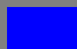

**Image.Image.resize**: monkey-patched to handle zero-width/height sizes and default to LANCZOS resampling.

```python
>> flag.resize((0,100))
<PIL.Image.Image image mode=RGBA size=0x100 at 0x4DEDEF0>
```

**Image.Image.resize_fixed_aspect**: resize an image, preserving its aspect ratio.

```python
>> flag.resize_fixed_aspect(scale=0.25).show()
```


```python
>> smallflag = flag.resize_fixed_aspect(width=100)
>> smallflag.show()
```


**Image.Image.pad_to_aspect**: pad an image so that it has the given aspect ratio (specified by one or two numbers).

```python
>> smallflag.pad_to_aspect(1, bg="grey").show()
```


```python
>> smallflag.pad_to_aspect(800, 600, align=0).show()
```


**Image.Image.padded_resize**: resize an image, after first padding it to the right aspect ratio.

```python
>> flag.padded_resize((100,100), bg="grey").show()
```


**Image.Image.crop_to_aspect**: crop an image so that it has the given aspect ratio (specified by one or two numbers).

```python
>> smallflag.crop_to_aspect(1).show()
```


```python
>> smallflag.crop_to_aspect(800, 600, align=0).show()
```


**Image.Image.cropped_resize**: resize an image, after first cropping it to the right aspect ratio.

```python
>> flag.cropped_resize((100,100)).show()
```


**Image.Image.blend**: blends two images together, using sRGB gamma correction by default. Similarly, **ImageColor.brighten** and **ImageColor.darken** blend with white and black, while preserving alpha. Requires numpy.

```python
>>  Image.from_row([smallflag.darken(0.5),
                    smallflag.blend(Rectangle(smallflag.size, "green"), 0.5),
                    smallflag.brighten(0.5)]).show()
```


**Image.Image.alpha_blend**: alpha blend two images together. Same as alpha_composite, but supports sRGB gamma correction (and is a fair bit slower).

**Image.Image.replace_color**: return an image with one color replaced by another color or pattern. To replace multiple colors at the same time, use **Image.Image.replace_colors**; to select a color as an image mask, use **Image.Image.select_color**. Requires numpy.

```python
>> base = Image.new("RGB", (80,40), "blue").pad(5, "black")
>> img = Image.from_text("red", arial(24), "blue")
>> base.replace_color("blue", "grey").place(img.replace_color("blue", "red", ignore_alpha=True)).show()
```


```python
>> base.replace_color("blue", flag.resize_fixed_aspect(width=30)).show()
```


**Image.Image.remove_transparency**: return an flatenned image copy composited over a colored background.

```python
>> red = Image.from_text("red", arial(24), "red", padding=10)
>> red.remove_transparency("grey").show()
```


**Image.Image.as_mask**: convert the image for use as a mask (returning an "L"-mode representation of the alpha channel for RGBA images, while leaving "1" and "L" mode images unchanged).

```python
>> red.as_mask().show()
```


**Image.Image.invert_mask**: like as_mask, but inverts the result.

```python
>> red.invert_mask().show()
```
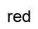

**Image.Image.add_grid**: add grid lines to an image.

```python
>> Image.from_text("grid", arial(24), "grey", "white", padding=10).add_grid((4,3)).show()
```
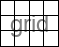

**Image.Image.add_shadow**: add a drop shadow to a transparent image.

```python
>> Image.from_text("The rain", arial(24, bold=True), "#1f5774", padding=10).add_shadow("#00000080", offset=(2,2), blur=2).show()
```


**Image.to_palette**: convert an image to "P" (palette) mode, using a given palette and optional dithering.

```python
>> pal = ["red", "green", "blue", "white", "black"]
>> grad = Image.from_gradient(cmap2, (100,100))
>> Image.from_row([grad, grad.to_palette(pal), grad.to_palette(pal, dither=True)]).add_grid((3,1)).show()
```

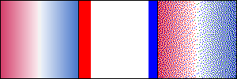

**Image.to_rgba**: convert an image to RGBA, or leave as is if it already is one.

### ImageShape

An abstract base class for encapsulating simple geometric shape generation (mostly implemented with numpy). Shapes may be generated either as masks, by calling their `mask` method, or as images, by using their constructor. Note that the shape classes act as factories only: masks are returned as mode "L" images, shapes as mode "RGBA" images.

The mask methods accept a size and shape-specific parameters. The constructor methods also accept foreground and background colors or patterns or a foreground colormap, as well as invert and antialias parameters.

**Rectangle**: generate rectangular shapes or masks.

```python
>> Rectangle((100,50), "grey", round=0.5).show()
```


```python
>> Rectangle((100,50), flag.resize_fixed_aspect(width=30)).show()
```


**Triangle**: generate triangular shapes or masks, with a parameter p indicating how far along the top (if p>0) or bottom-left (if p<0) vertices are.

```python
>> Image.from_array([[Triangle(40, "grey", p=i*n/4) for n in range(5)] for i in [1,-1]], padding=5).show()
```
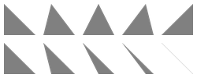

**Diamond**: generate diamond shapes or masks, with a parameter p indicating how far down the left-right vertices are.

```python
>> Image.from_row([Diamond(40, "grey", p=n/4) for n in range(5)], padding=5).show()
```
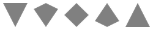

**Parallelogram**: generate parallelogram shapes or masks, with a parameter p indicating how far along the top-left (if p>0) or bottom-left (if p<0) vertices are.

```python
>> Image.from_array([[Parallelogram(40, "grey", p=i*n/4) for n in range(5)] for i in [1,-1]], padding=5).show()
```
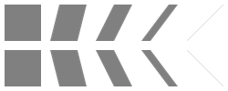

**Trapezoid**: generate trapezoid shapes or masks, with a parameter p indicating how far along the top (if p>0) or bottom (if p<0) vertices are.

```python
>> Image.from_array([[Trapezoid(40, "grey", p=i*n/4) for n in range(5)] for i in [1,-1]], padding=5).show()
```
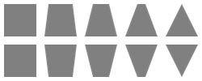

**Stripe**: generate tilable diagonal stripes of given relative widths or number.

```python
>> Image.from_pattern(Stripe(10, "black", "grey", intervals=(3,1)), (80, 50)).show()
```
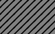

```python
>> Stripe((80,50), GradientColormap("red", "green", "blue"), intervals=3).show()
```
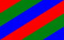


**Checkers**: generate a checkers grid pattern of a given shape and number of colors.

```python
>> Checkers((80,50), "black", "grey", shape=(8,5)).show()
```
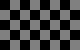
 
```python
>> Checkers((80,50), GradientColormap("red", "green", "blue"), shape=(8,5), colors=3).show()
```
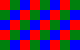

**Ellipse**: generate elliptical (or circular) shapes or masks.

```python
>> Ellipse((80,50), Diamond(10, "black", "grey")).show()
```
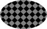

**Quadrant**: generate elliptical (or circular) quadrant shapes or masks.

```python
>> Quadrant((80,50), Diamond(10, "black", "grey")).show()
```


**MaskUnion**: generate a shape from the union of a collection of masks (mode "L" images or alpha channels of other images). Automatically calculates the size if set to `...`.

```python
>>  MaskUnion(..., masks=(Triangle(50), Ellipse(40))).show()
```


**MaskIntersection**:  generate a shape from the intersection of a collection of masks (mode "L" images or alpha channels of other images). Automatically calculates the size if set to `...`. The `include_missing` parameters specifies how to treat areas that are missing from smaller masks.

```python
>> pizza = MaskIntersection(..., masks=(Triangle(50), Ellipse(40)))
>> pizza.show()
```
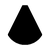

```python
>> MaskIntersection(..., masks=(Diamond(50), Ellipse(20, invert=True)), include_missing=True).show()
```
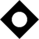

**MaskBorder**: generate a border of a given width from a mask.  Automatically calculates the size if set to `...`. Requires scipy.

```python
>> MaskBorder(..., mask=pizza, width=2).show()
```
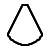
